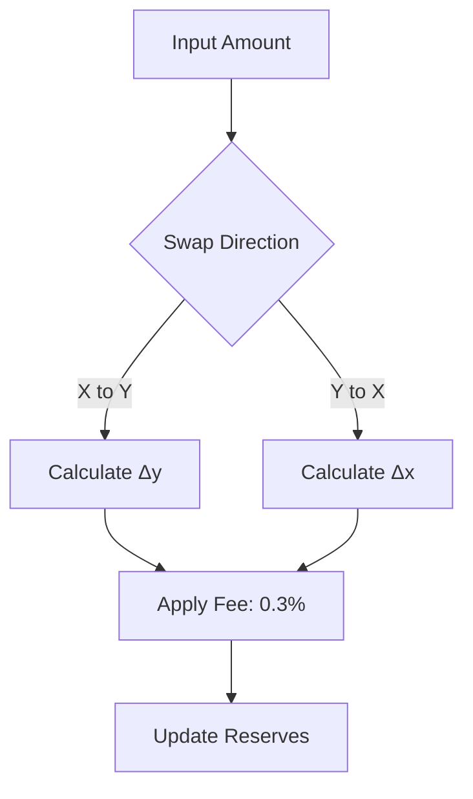
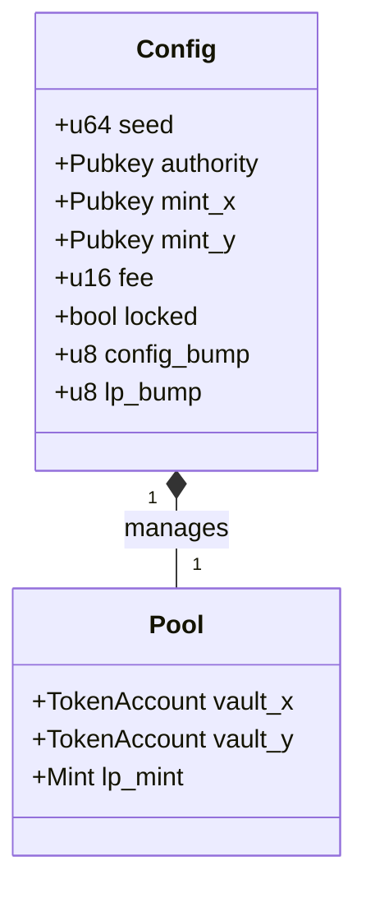
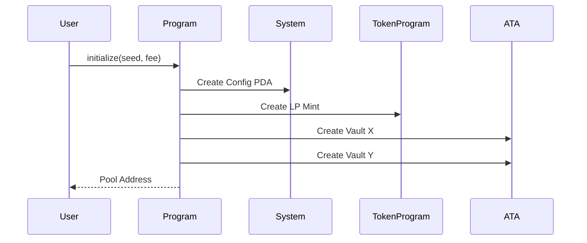
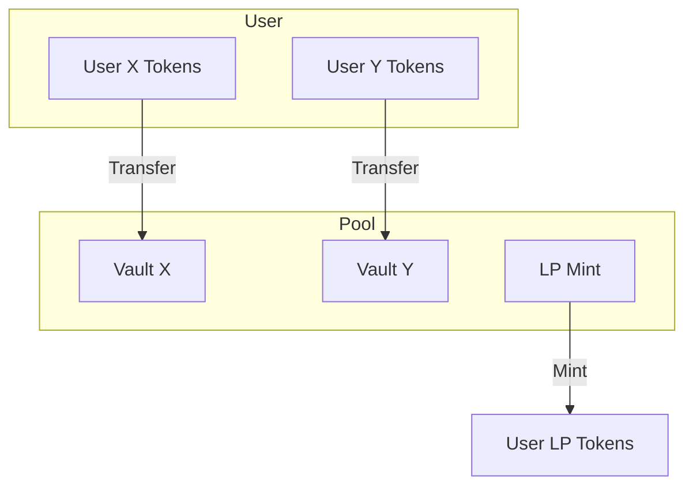
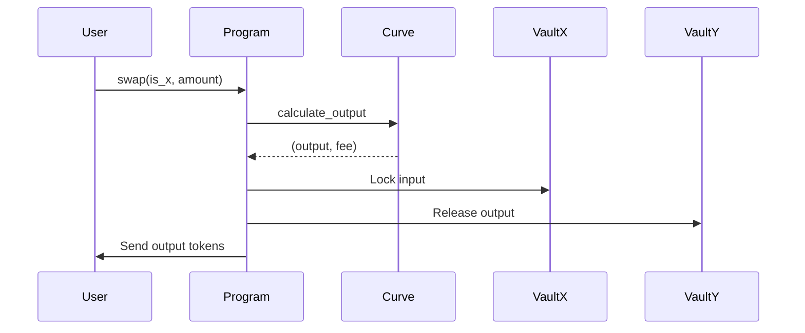
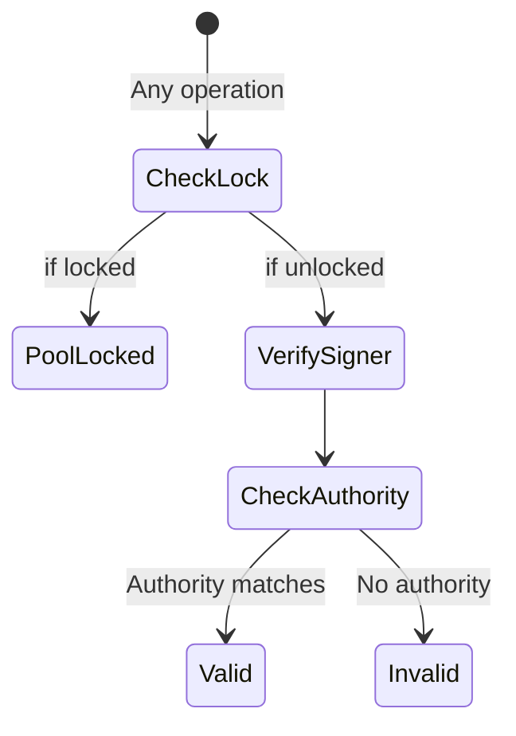
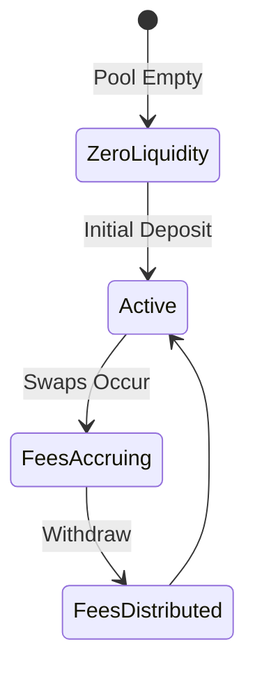
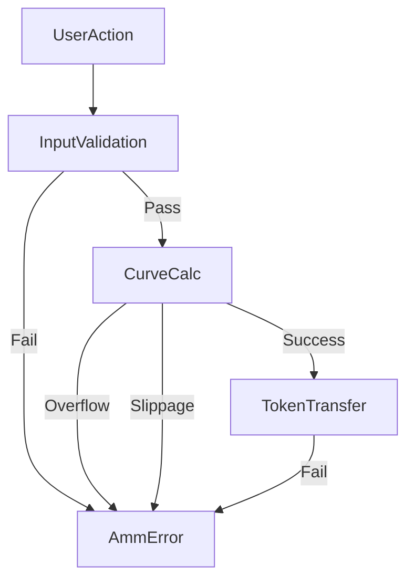
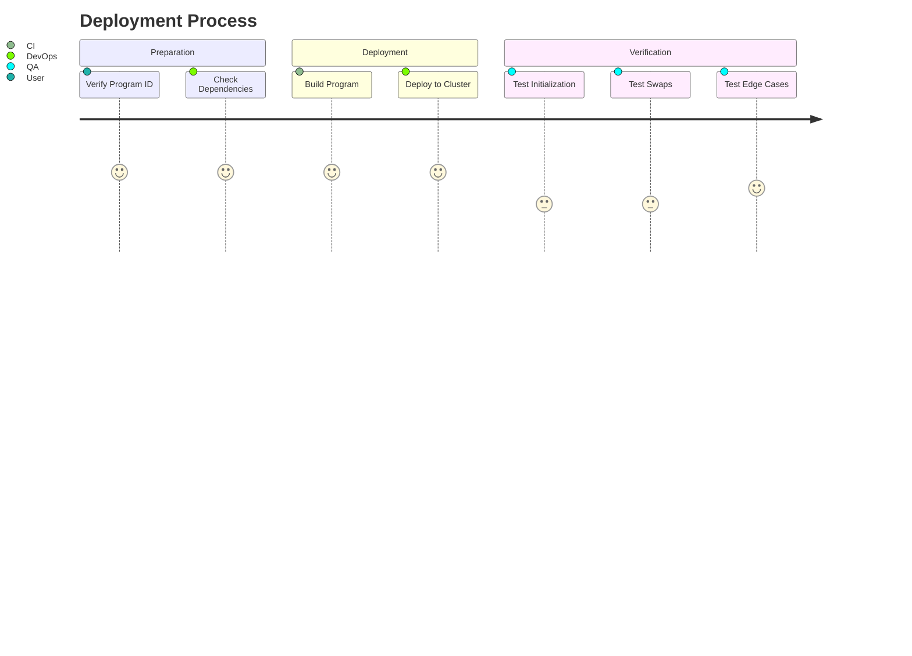

# Solana Automated Market Maker (AMM) Program


## Table of Contents
1. [Mathematical Foundations](#mathematical-foundations)
2. [Core Smart Contract Design](#core-smart-contract-design)
3. [Token Flow Diagrams](#token-flow-diagrams)
4. [Security Mechanisms](#security-mechanisms)
5. [Fee Structure](#fee-structure)
6. [Error Handling System](#error-handling-system)
7. [Deployment Guide](#deployment-guide)
8. [Testing Strategy](#testing-strategy)

---

## Mathematical Foundations

### Constant Product Formula
```math
x * y = k
Δy = (Δx * y) / (x + Δx)
```
**Swap Calculation with Fees**  




---

## Core Smart Contract Design

### State Management


### Initialize Sequence


---

## Token Flow Diagrams

### Deposit Mechanism


### Swap Mechanism


---

## Security Mechanisms

### PDA Derivation
```rust
// Config PDA
seeds = [
    b"config", 
    config.seed.to_le_bytes().as_ref()
]

// LP Mint PDA
seeds = [
    b"lp", 
    config.key().as_ref()
]
```

### Authorization Flow


---

## Fee Structure

### Fee Distribution Model
```math
effective_fee = input_amount * fee_bps / 10_000
protocol_fee = effective_fee * 0.2  # 20% to protocol
lp_fee = effective_fee * 0.8        # 80% to LPs
```

### Fee State Machine


---

## Error Handling System

### Error Propagation


### Error Recovery Matrix
| Error Type           | Auto-Retry | Manual Intervention | Logging Level |
|----------------------|------------|---------------------|---------------|
| SlippageExceeded     | Yes        | No                  | Warning       |
| PoolLocked           | No         | Admin               | Critical      |
| InvalidAuthority     | No         | Admin               | Critical      |
| InsufficientBalance  | No         | User                | Error         |

---

## Deployment Guide

### Cluster Compatibility
| Network      | Supported | Test Status |
|--------------|-----------|-------------|
| Mainnet-beta | Yes       | Audited     |
| Devnet       | Yes       | Verified    |
| Testnet      | Yes       | Verified    |
| Localnet     | Yes       | CI/CD       |

### Deployment Checklist


---

## Testing Strategy

### Test Coverage Targets
| Component         | Target % | Current % |
|-------------------|----------|-----------|
| Deposit/Withdraw  | 100%     | 98%       |
| Swap Logic        | 100%     | 95%       |
| Error Conditions  | 100%     | 100%      |
| Fee Calculations  | 100%     | 100%      |

### Fuzz Testing Parameters
```yaml
swap_tests:
  iterations: 10_000
  parameters:
    amount_range: [1, 1_000_000]
    fee_range: [0, 10_000]
    slippage_range: [0, 50%]
    
liquidity_tests:
  max_tokens: 1e18
  decimal_variants: [6, 9, 18]
```

License
MIT License - See LICENSE for details.

